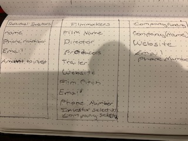
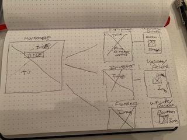

WDI_Project_2

Project: 
Heroku Link:https://dashboard.heroku.com/apps/stark-bastion-45598/resources
Trello Board: https://trello.com/b/biLCtNJL/project-2
Technologies Used:
Javascript, CSS, NodeJs, Express, MongoDb, Mongoose 
 
 Goal:
Create an app that allows independent films to easily access funds. Allowing professionals outside of the film industry to easily fund independent films
 
 Next Version:
I would like to add functions that allow money transactions 

